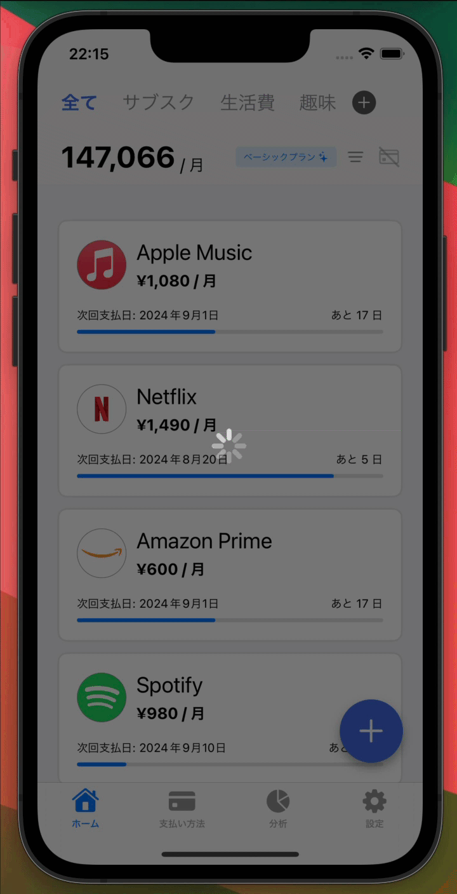

# ForegroundActivityIndicator

`ForegroundActivityIndicator` は SwiftUI で使用可能なモディファイアです。
このモディファイアを使用すると、画面の最前面にアクティビティインジケーターを表示することができます。
アクティビティインジケーターの表示中は、画面にオーバーレイが表示され、ユーザーの操作を受け付けなくなります。



## 対応バージョン

- iOS 17.0+

## 機能

- アクティビティインジケーターの表示/非表示の切り替え
- オーバーレイの表示によるユーザーの操作制限

## インストール

ForegroundActivityIndicator を Swift Package Manager を使用してインストールするには、`Package.swift` ファイルに以下を追加します。

```swift
dependencies: [
    .package(url: "https://github.com/sakes9/ForegroundActivityIndicator.git", from: "{{ version }}")
]
```

次に、`ForegroundActivityIndicator` をターゲットの依存関係として追加します。

```swift
.target(
    name: "YourTargetName",
    dependencies: ["ForegroundActivityIndicator"]
)
```

## 使い方

ForegroundActivityIndicator を使用するには、`ForegroundActivityIndicator` モディファイアをビューに適用します。

```swift
import ForegroundActivityIndicator // パッケージをインポート
import SwiftUI

struct ContentView: View {
    @State var isVisible = false// アクティビティインジケーターの表示状態

    var body: some View {
        TabView {
            NavigationView {
                VStack {
                    Image(systemName: "1.circle.fill")
                        .resizable()
                        .frame(width: 100, height: 100)
                }
                .navigationTitle("画面1")
                .toolbarBackground(.visible, for: .navigationBar)
                .toolbarBackground(Color.blue, for: .navigationBar)
                .toolbarColorScheme(.dark, for: .navigationBar)
                .navigationBarTitleDisplayMode(.inline)
                .activityIndicator(isVisible: isVisible,
                                backgroundColor: .gray.withAlphaComponent(0.5),
                                indicatorColor: .white)
                .onAppear {
                    isVisible = true
                }
            }
            .tag(0)
            .tabItem { Label("One", systemImage: "1.circle") }

            NavigationView {
                VStack {
                    Image(systemName: "2.circle")
                        .resizable()
                        .frame(width: 100, height: 100)
                }
            }
            .tag(1)
            .tabItem { Label("Two", systemImage: "2.circle") }
        }
    }
}
```

### パラメーター

| パラメーター | 型 | 説明 | デフォルト
| --- | --- | --- | ---
| `isVisible` | `Bool` | アクティビティインジケーターの表示状態 | -
| `backgroundColor` | `UIColor` | オーバーレイの背景色 | `.clear`
| `indicatorColor` | `UIColor` | アクティビティインジケーターの色 | `.darkGray`
